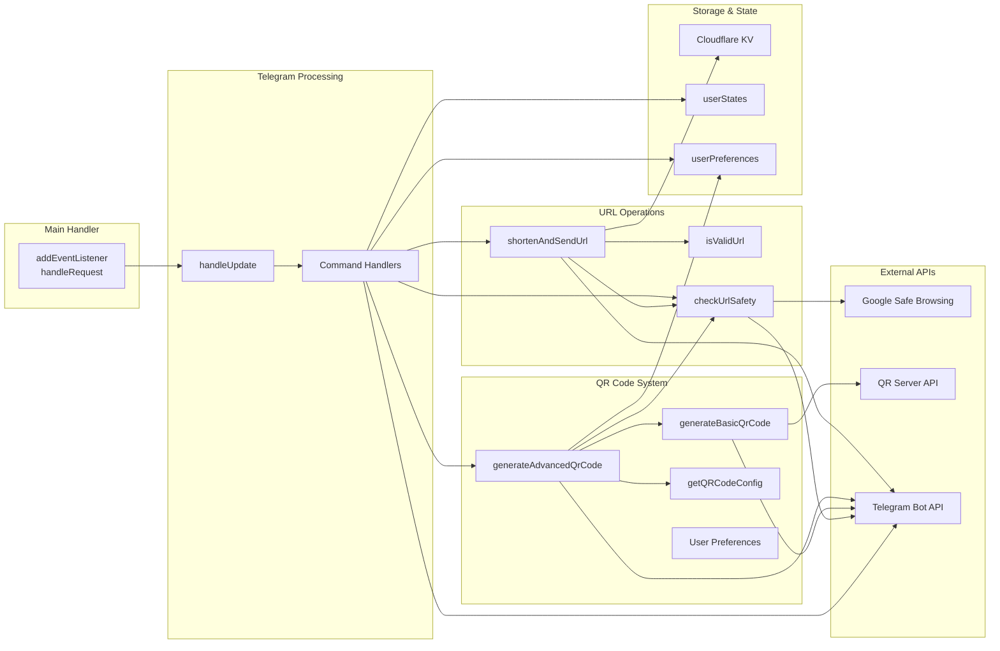

# AI Documentation - Cloudflare Telegram Bot Project

This documentation is specifically designed for AI assistants to understand the codebase structure, functionality, and development context.

## Project Overview

This repository contains a **Cloudflare Telegram Bot** - A sophisticated Telegram bot for URL shortening and QR code generation, deployed on Cloudflare Workers for edge computing performance.

## Project Structure

```
cloudflare-telegram-bot/
├── src/
│   └── index.js                    # Main Telegram bot worker script
├── test/
│   └── index.spec.js              # Test files for bot
├── package.json                   # Bot dependencies
├── wrangler.jsonc                 # Cloudflare Worker configuration
├── vitest.config.js               # Test configuration
└── README.md                      # Bot documentation
```

---

## Cloudflare Telegram Bot

### Technology Stack
- **Runtime**: Cloudflare Workers (Edge computing)
- **Language**: JavaScript (ES modules)
- **Framework**: telegram-webhook-js for Telegram Bot API
- **QR Generation**: qr-code-styling with fallback to external API
- **Storage**: Cloudflare KV (Key-Value store)
- **Security**: Google Safe Browsing API for URL validation
- **Testing**: Vitest with Cloudflare Workers pool

### Core Functionality

#### Main Features
1. **URL Shortening**: Converts long URLs to short codes stored in Cloudflare KV
2. **QR Code Generation**: Creates styled QR codes with multiple design options
3. **URL Safety Checking**: Validates URLs using Google Safe Browsing API
4. **User Preferences**: Persistent QR styling preferences per user

#### Bot Commands
- `/start` - Welcome message and feature overview
- `/help` - Complete command reference
- `/qrcode [url]` - Generate styled QR code (interactive or with URL)
- `/qrstyle` - Set QR code style (square/rounded/dots)
- `/qrcolor` - Set color scheme (8 options available)
- `/qrsettings` - View current preferences
- `/qrpreview` - Preview all available styles
- `/checkurl [url]` - Check URL safety (interactive or with URL)
- Direct URL sending - Automatic URL shortening

#### Code Architecture

**Main Entry Points:**
- `addEventListener('fetch', ...)` - Main request handler
- `handleRequest()` - Routes requests to appropriate handlers
- `handleUpdate()` - Processes Telegram webhook updates

**Key Functions:**
- `generateAdvancedQrCode()` - Creates styled QR codes with user preferences
- `generateBasicQrCode()` - Fallback QR generation using external API
- `checkUrlSafety()` - Google Safe Browsing API integration
- `shortenAndSendUrl()` - URL shortening logic with KV storage
- `getUserPreferences()` / `setUserPreferences()` - User state management

**Configuration Objects:**
- `QR_STYLES` - Available QR code styles (square, rounded, dots)
- `COLOR_SCHEMES` - 8 predefined color schemes with foreground/background/accent colors
- `userStates` - Manages multi-step user interactions
- `userPreferences` - Stores persistent user QR preferences

#### Environment Variables
- `BOT_TOKEN` - Telegram bot token (Cloudflare Workers secret)
- `GOOGLE_API_KEY` - Google Safe Browsing API key (Cloudflare Workers secret)

#### External Dependencies
- **telegram-webhook-js**: Telegram Bot API wrapper
- **qr-code-styling**: Advanced QR code generation with styling
- **canvas**: Required for QR code generation in Workers environment

---

## Architecture Diagram

```mermaid
graph TB
    subgraph "External Services"
        TG[Telegram Bot API]
        GSB[Google Safe Browsing API]
        QR_EXT[QR Server API<br/>qrserver.com]
    end
    
    subgraph "Cloudflare Infrastructure"
        CF_EDGE[Cloudflare Edge Network]
        CF_WORKER[Cloudflare Worker<br/>src/index.js]
        CF_KV[(Cloudflare KV Store<br/>URL Mappings)]
        CF_SECRETS[Cloudflare Secrets<br/>BOT_TOKEN<br/>GOOGLE_API_KEY]
    end
    
    subgraph "User Interactions"
        USER[Telegram User]
        BROWSER[Web Browser]
    end
    
    subgraph "Bot Core Components"
        WEBHOOK[Webhook Handler<br/>handleUpdate()]
        URL_SHORT[URL Shortener<br/>shortenAndSendUrl()]
        QR_GEN[QR Generator<br/>generateAdvancedQrCode()]
        SAFETY[Safety Checker<br/>checkUrlSafety()]
        REDIRECT[URL Redirector<br/>handleRequest()]
        USER_PREFS[User Preferences<br/>userPreferences{}]
        USER_STATES[User States<br/>userStates{}]
    end
    
    %% User Flow
    USER -->|Send Message| TG
    TG -->|Webhook POST| CF_EDGE
    CF_EDGE -->|Route to Worker| CF_WORKER
    
    %% Worker Internal Flow
    CF_WORKER --> WEBHOOK
    WEBHOOK --> USER_STATES
    WEBHOOK --> URL_SHORT
    WEBHOOK --> QR_GEN
    WEBHOOK --> SAFETY
    
    %% URL Shortening Flow
    URL_SHORT --> SAFETY
    SAFETY -->|Check URL| GSB
    URL_SHORT -->|Store Short Code| CF_KV
    URL_SHORT -->|Get Secrets| CF_SECRETS
    
    %% QR Code Generation Flow
    QR_GEN --> USER_PREFS
    QR_GEN --> SAFETY
    QR_GEN -->|Fallback| QR_EXT
    QR_GEN -->|Send Photo| TG
    
    %% URL Redirection Flow
    BROWSER -->|Access Short URL| CF_EDGE
    CF_EDGE --> CF_WORKER
    CF_WORKER --> REDIRECT
    REDIRECT -->|Lookup| CF_KV
    REDIRECT -->|301 Redirect| BROWSER
    
    %% Response Flow
    WEBHOOK -->|Send Response| TG
    TG -->|Deliver Message| USER
    
    %% Styling
    classDef userNode fill:#e1f5fe
    classDef cloudflareNode fill:#ff9800,color:#fff
    classDef externalNode fill:#4caf50,color:#fff
    classDef coreNode fill:#2196f3,color:#fff
    
    class USER,BROWSER userNode
    class CF_EDGE,CF_WORKER,CF_KV,CF_SECRETS cloudflareNode
    class TG,GSB,QR_EXT externalNode
    class WEBHOOK,URL_SHORT,QR_GEN,SAFETY,REDIRECT,USER_PREFS,USER_STATES coreNode
```

## Data Flow and Relationships

### 1. Telegram Message Processing Flow
```
User Message → Telegram API → Cloudflare Worker → handleUpdate() → Command Handler → Response → Telegram API → User
```

### 2. URL Shortening Flow
```
URL Input → Safety Check (Google API) → Generate Short Code → Store in KV → Return Short URL
```

### 3. QR Code Generation Flow
```
URL Input → Safety Check → Get User Preferences → Generate Styled QR → Fallback if Failed → Send to Telegram
```

### 4. URL Redirection Flow
```
Short URL Access → Worker Router → KV Lookup → 301 Redirect to Original URL
```

### 5. User State Management
```
Multi-step Commands → Store in userStates{} → Process Next Input → Clear State → Complete Action
```

## Component Relationships

### Core Components and Their Dependencies



## State Management Architecture

### User Session States
```javascript
userStates = {
    [chatId]: {
        waitingFor: 'qr_url' | 'qr_style' | 'qr_color' | 'check_url'
        // Cleared after processing
    }
}
```

### User Preferences (Persistent)
```javascript
userPreferences = {
    [chatId]: {
        style: 'square' | 'rounded' | 'dots',
        colorScheme: 'classic' | 'blue' | 'green' | 'purple' | 'red' | 'orange' | 'teal' | 'pink'
    }
}
```

### URL Storage (KV)
```javascript
// Key: shortCode (6 chars)
// Value: originalUrl (string)
await shorturl.put(shortCode, originalUrl)
```

## Security Architecture

### Authentication Flow
1. **Secrets Management**: BOT_TOKEN and GOOGLE_API_KEY stored in Cloudflare Workers secrets
2. **URL Validation**: All URLs checked against Google Safe Browsing before processing
3. **Input Sanitization**: URL validation using native URL constructor
4. **Rate Limiting**: Inherent from Telegram Bot API rate limits

### Data Protection
- No sensitive user data stored permanently
- User preferences stored in memory (temporary)
- Only URL mappings persisted in KV store
- No personal information logged

---

## Development Guidelines for AI Assistants

### Code Style and Conventions

#### Telegram Bot (JavaScript):
- Use ES modules syntax
- Prefer `async/await` over promises
- Use descriptive function names
- Handle errors gracefully with try/catch
- Use environment variables for secrets (Cloudflare Workers secrets)
- Follow Cloudflare Workers patterns for request handling

### Security Considerations

1. **Secrets Management**: Never hardcode API keys or passwords
2. **URL Validation**: Always validate URLs before processing
3. **Input Sanitization**: Use native URL constructor for validation
4. **Safe Browsing**: Always check URLs against Google Safe Browsing API

### Performance Optimization

1. **Edge Computing**: Leverage Cloudflare Workers edge network for global performance
2. **KV Storage**: Use Cloudflare KV for efficient URL lookup and storage
3. **Async Operations**: Use non-blocking operations for all external API calls
4. **Fallback Systems**: Implement graceful fallbacks for QR generation

### Testing Strategy

1. **Unit Tests**: Test individual functions (URL validation, short code generation)
2. **Integration Tests**: Test Telegram webhook handling and external API interactions
3. **Worker Tests**: Use Cloudflare Workers testing utilities with Vitest
4. **Mock Testing**: Mock external APIs for reliable testing

### Deployment Considerations

#### Telegram Bot:
- Deploy to Cloudflare Workers using `wrangler deploy`
- Configure KV namespace for URL storage (see wrangler.jsonc)
- Set up Telegram webhook endpoint pointing to worker URL
- Configure secrets using `wrangler secret put BOT_TOKEN` and `wrangler secret put GOOGLE_API_KEY`
- Ensure proper webhook URL format: `https://your-worker.workers.dev/webhook`

### Common Development Tasks

#### Adding New Bot Commands:
1. Add command handler condition in `handleUpdate()` function src/index.js:431-574
2. Implement command logic function in the same file
3. Update help text in the `/help` command handler
4. Update README.md with new command documentation
5. Add corresponding tests in test/index.spec.js

#### Adding New QR Styles or Colors:
1. Modify `QR_STYLES` or `COLOR_SCHEMES` objects src/index.js:8-23
2. Update `getQRCodeConfig()` function to handle new styles src/index.js:161-229
3. Test the new styles with `/qrpreview` command
4. Update documentation

#### Modifying URL Handling:
1. Update `isValidUrl()` function for validation logic src/index.js:95-102
2. Modify `shortenAndSendUrl()` for shortening logic src/index.js:348-377
3. Update redirect handling in main `handleRequest()` src/index.js:78-88
4. Test with various URL formats

### Troubleshooting Common Issues

1. **Webhook Issues**: Check Cloudflare Workers logs with `wrangler tail --format pretty`
2. **Secret Access**: Verify secrets are set with `wrangler secret list`
3. **KV Namespace**: Ensure KV namespace ID matches wrangler.jsonc configuration
4. **QR Generation**: Check fallback to external API if styled QR fails
5. **URL Safety**: Verify Google Safe Browsing API key and quota limits
6. **Bot Response**: Use Telegram's `getWebhookInfo` to check webhook status

---

## File Modification Guidelines

### When modifying the Telegram Bot:
- **Main logic**: All bot functionality is in `src/index.js` (585 lines)
- **Tests**: Update tests in `test/index.spec.js`
- **Configuration**: Modify `wrangler.jsonc` for KV namespaces, secrets, or worker settings
- **Dependencies**: Update `package.json` for new npm packages
- **Environment**: Use `wrangler secret put` for sensitive configuration

### Key File Locations:
- `src/index.js:28-92` - Main request handler and routing
- `src/index.js:95-158` - Utility functions (URL validation, safety checking)
- `src/index.js:161-304` - QR code generation system
- `src/index.js:307-345` - User preference management
- `src/index.js:379-583` - Telegram message handling and command processing

### Documentation Updates:
- Update `README.md` for user-facing changes and new commands
- Update this `AI_DOCUMENTATION.md` for architectural or code structure changes
- Update `package.json` description and scripts as needed

### Best Practices for Code Changes:
1. **Function Placement**: Keep related functions together (QR code functions, URL functions, etc.)
2. **Error Handling**: Always include try/catch blocks for external API calls
3. **User Feedback**: Provide clear error messages to users in Telegram
4. **Fallback Systems**: Implement graceful degradation (e.g., basic QR when advanced fails)
5. **State Management**: Clean up user states after multi-step operations complete
6. **Code Comments**: Add comments for complex logic, especially QR styling configurations

This documentation provides a comprehensive overview for AI assistants to understand, modify, and extend the Cloudflare Telegram Bot effectively.